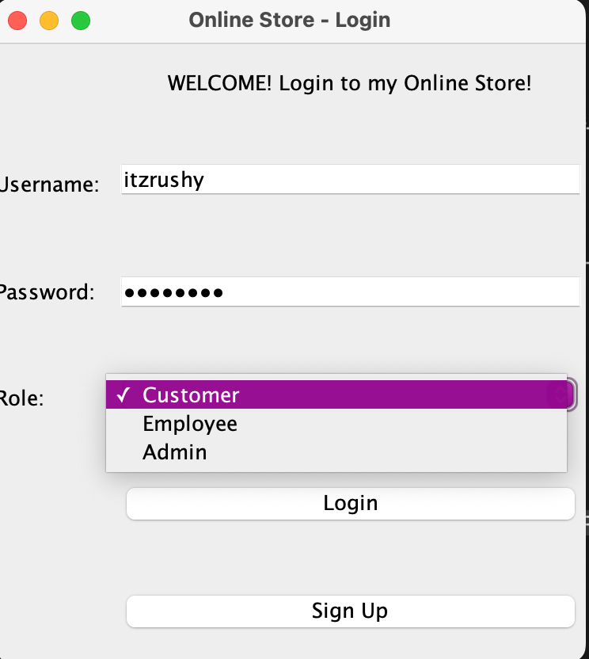
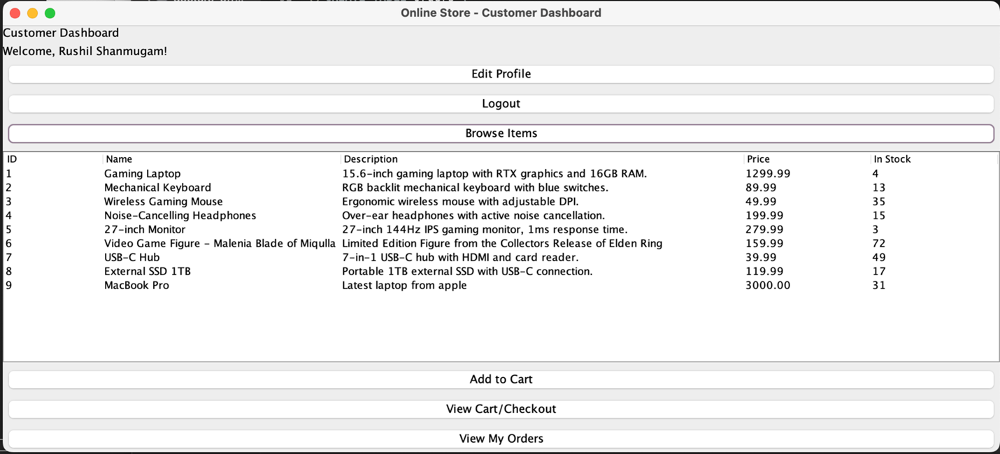
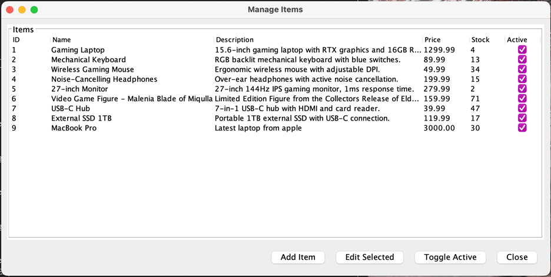

## Online Store Database Application (Solo Project)
A Java Swing + MySQL desktop application that simulates a role-based online store system. Built with a normalized relational schema (`online_store_db`) and SQL-driven GUI workflows for Customers, Employees, and Admins.

### Features
**Customer**
- Browse items, manage a cart, and place orders
- View order history, cancel orders, and update account information

**Employee**
- Manage store inventory (add/update/remove items)
- View customer accounts and customer orders

**Admin**
- Manage employee and customer accounts
- Control order lifecycle/status updates

### Tech Stack
- Java (IntelliJ) + Swing (GUI)
- MySQL (`online_store_db`)
- SQL queries for CRUD operations (users, items, orders, order_items, coupons)

### Screenshots

### Database Setup
1. Create a MySQL database schema named:
   - `online_store_db`
2. Run the SQL script(s) in the `sql/` folder (recommended order):
   - `sql/schema.sql`
   - `sql/seed.sql` (optional, if included)

### Database Configuration (Simple)
This project connects to a local MySQL instance. For a public GitHub repo, credentials are not included.

Update the database username/password in:
- `Database.java` (contains the `jdbc:mysql` / `DriverManager.getConnection` logic)

Use placeholders in the public repo:
- DB user: `YOUR_DB_USER`
- DB password: `YOUR_DB_PASSWORD`

### How to Run
1. Clone the repository
2. Open the project in IntelliJ (or VS Code with Java support)
3. Complete the **Database Setup** steps above
4. Update DB credentials in `Database.java`
5. Run the application by running:
   - `LoginFrame.java` (contains `public static void main`)

### Notes
- Completed as a solo final project for a Database Systems course.
- Build artifacts (e.g., `.jar` files in an `artifacts/` folder) are not required for running from source and are typically excluded from version control.
- Recommended: add screenshots of the GUI to an `assets/` folder and link them here.

**Dependency Note (MySQL JDBC Driver):**  
This project requires the MySQL JDBC driver (MySQL Connector/J). If it is not already included, add the Connector/J `.jar` to your project libraries/classpath in IntelliJ before running.

**MySQL Connector/J:**  
If you see a “No suitable driver” or connection error, add MySQL Connector/J to the project classpath (IntelliJ: File → Project Structure → Libraries → +).

