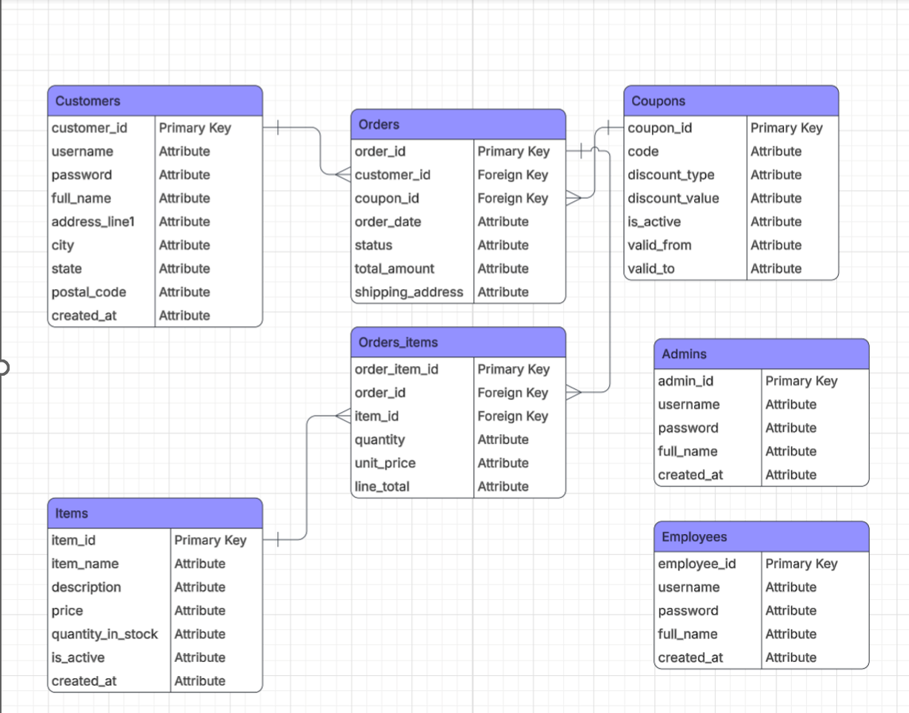

## Online Store Database Application (Solo Project)

A **solo Java Swing + MySQL desktop application** that simulates a role-based online store system. Built on a normalized relational schema (`online_store_db`), the project uses SQL-driven GUI workflows for Customers, Employees, and Admins to support shopping, account management, inventory operations, and order lifecycle management.

## Overview

This project models the core workflows of an online store using a desktop GUI backed by a relational database. It demonstrates Java GUI development, database design, CRUD operations, and role-based functionality across multiple types of users.

## Features

### Customer
- Browse available items
- Manage a shopping cart
- Place orders
- View order history
- Cancel eligible orders
- Update account information

### Employee
- Manage store inventory by adding, updating, and removing items
- View customer accounts
- View customer orders

### Admin
- Manage employee and customer accounts
- Control order lifecycle and status updates

## Core Workflow

- Users create an account and sign in to access the system
- Users can manage personal calendar events within their own schedule
- Users can create or join groups for shared planning
- Group events can be created and viewed through the shared calendar workflow
- Admins can manage users, groups, and related calendar data

## Tech Stack

- Java
- Swing (GUI)
- MySQL (`online_store_db`)
- JDBC
- SQL for CRUD operations across users, items, orders, and order items
- IntelliJ IDEA

## Database Schema

The application is built on a normalized relational schema designed to support role-based store workflows, including customer accounts, inventory, orders, order items, and administrative user management.

## Screenshots

## Database Setup

1. Create a MySQL schema named:
   - `online_store_db`
2. In the `sql/` folder, run:
   - `FinalProject_db_CSCI300.sql`

## Database Configuration

This project connects to a local MySQL instance. Public repository credentials are not included.

Update the database connection settings in:
- `Database.java`

Replace the placeholder values in the connection logic with your local MySQL credentials:
- DB user: `YOUR_DB_USER`
- DB password: `YOUR_DB_PASSWORD`

## How to Run

1. Clone the repository
2. Open the project in IntelliJ IDEA or another Java IDE with Swing support
3. Complete the **Database Setup** steps above
4. Update the database credentials in `Database.java`
5. Make sure the MySQL JDBC driver is added to the project classpath
6. Run:
   - `LoginFrame.java`

## Project Structure

Key source files include:
- `LoginFrame.java` — application entry point
- `Database.java` — database connection logic
- `DBHelper.java` — database helper methods
- `CustomerDashboardFrame.java` — customer-side GUI
- `EmployeeDashboardFrame.java` — employee-side GUI
- `AdminDashboardFrame.java` — admin-side GUI

## Why This Project Matters

This project highlights:
- practical Java desktop application development
- relational database design with a normalized schema
- SQL-backed CRUD workflows
- role-based access and user-specific functionality
- integration between a GUI frontend and a MySQL backend

It also shows how database design decisions directly support different user roles and business workflows within the same application.

## Notes

- Completed as a **solo final project** for a Database Systems course
- Build artifacts are not required when running from source
- The application depends on a local MySQL setup
- The database schema also includes coupon-related data, although coupon functionality is not currently integrated into the GUI workflows

## Dependency Note (MySQL JDBC Driver)

This project requires the **MySQL JDBC driver** (MySQL Connector/J). If it is not already included, add the Connector/J `.jar` to your project libraries or classpath before running the application.

If you see a connection error such as “No suitable driver,” add MySQL Connector/J through your IDE’s project library settings.

## Future Improvements

- Add stronger input validation throughout the GUI
- Improve UI consistency and visual polish
- Add search/filter functionality for larger inventories
- Expand coupon and discount handling
- Improve order reporting and analytics

## Author

**Rushil Shanmugam**
